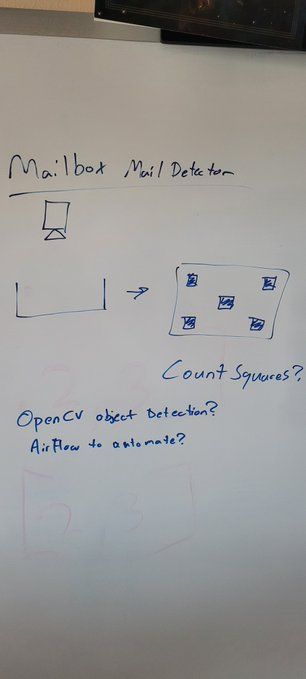
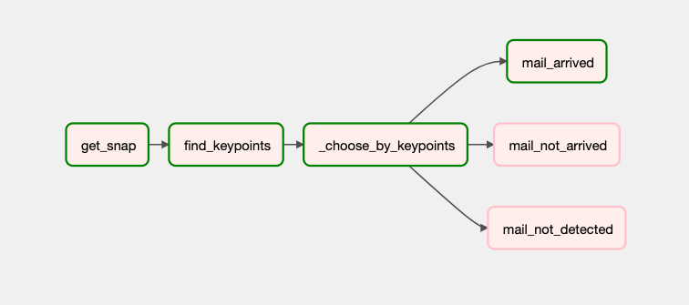
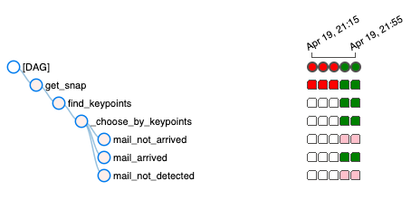
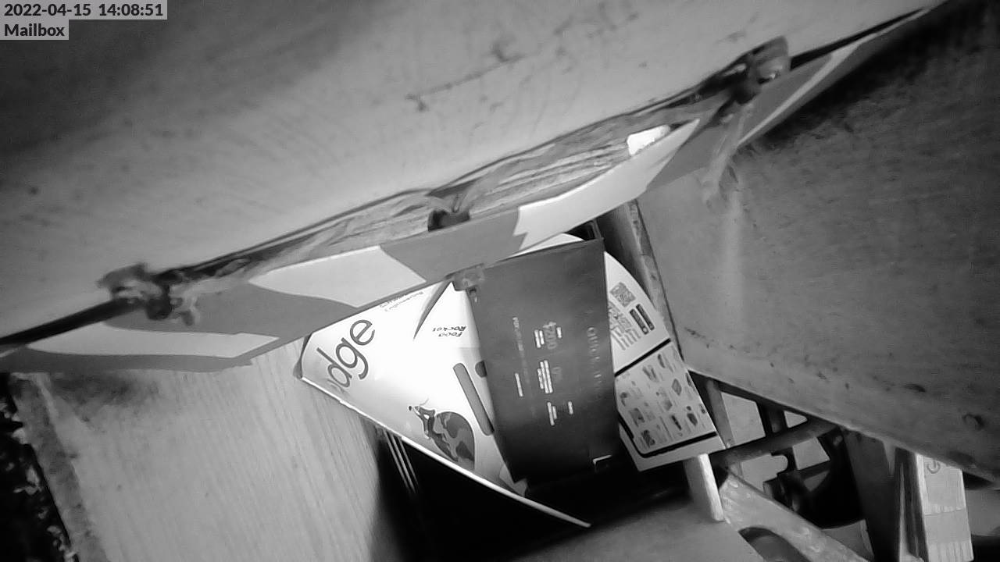
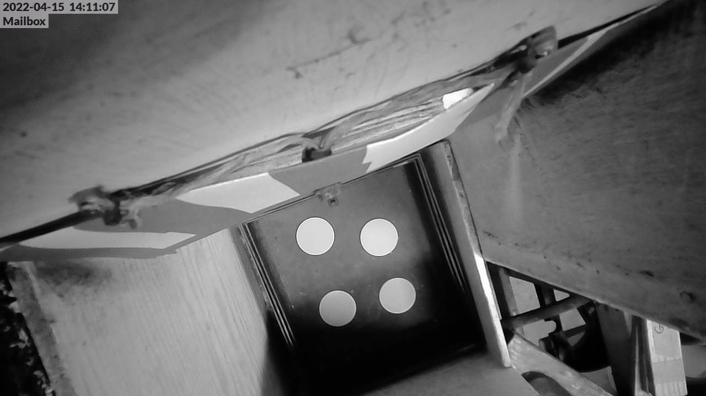
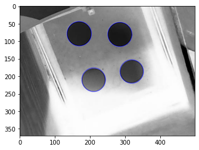

# MailBot 

MailBot is an Apache Airflow DAG for detecting mail in a postal mailbox.

Tasks executed to detect mail:

1. Download a camera snapshot from a remote IP camera.
2. Invert & crop image area of interest AOI.
3. Instantiate OpenCV BlobDetector and count blob keypoints in image AOI.
4. Conditinally execute command based on number of blob keypoints detected.

## Concept Diagram

## DAG Description

## Example snapshots

# Copyright

Copyright 2022 Greg Albrecht W2GMD oss@undef.net

# License

Apache License, Version 2.0

# Source

https://github.com/ampledata/mailbot_dag
